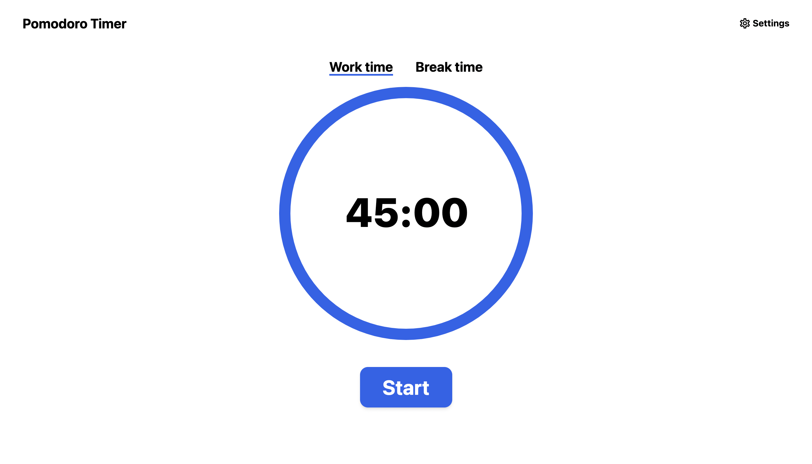
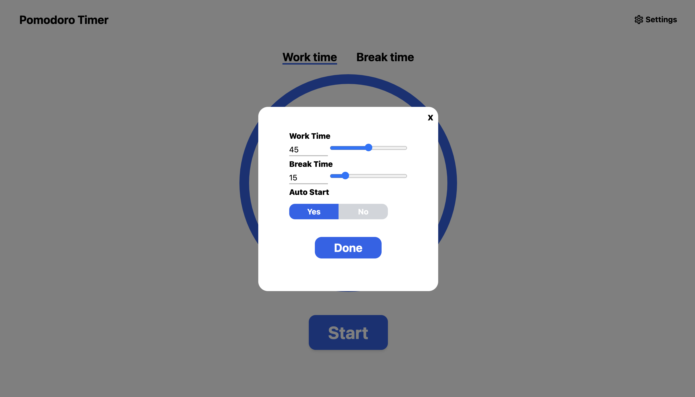
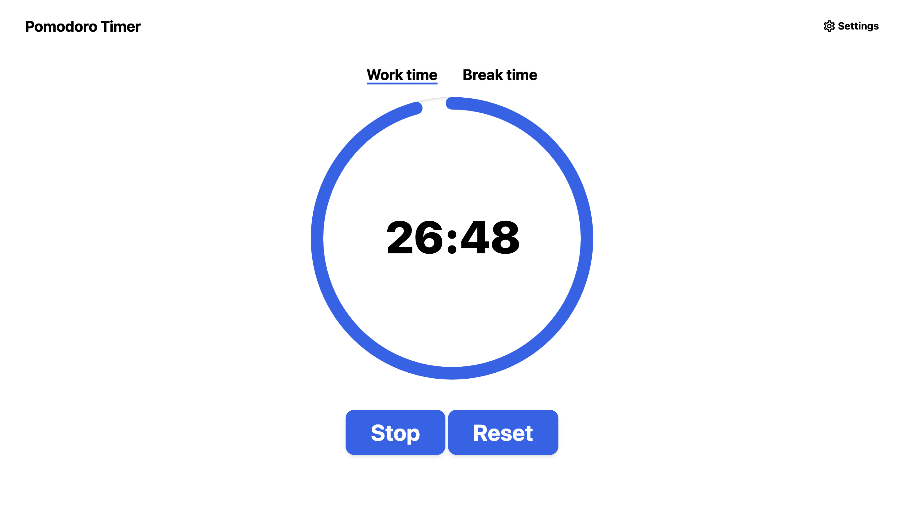

# Timer for studying built with Svelte ⏱ 📚
## About
This project is a simple and minimalistic timer with the purpose of boosting productivity by measuring work and break times.

[Check it out]


## Preview: 





## Running the project
### Local setup
To run this project locally: 
1. Clone the project locally, change into the directory, and install the dependencies:

```sh
git clone https://github.com/Kwapy/Study-timer-svelte

cd Study-timer-svelte

# install using NPM
npm install
```

2. Start the app

```
npm run dev
```

[Check it out]: https://studytimer.vercel.app
